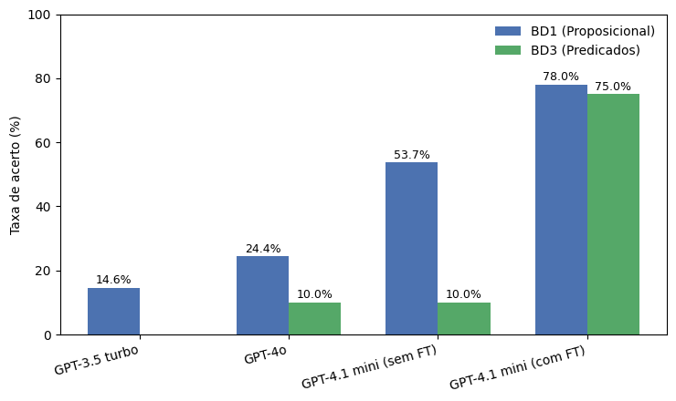

# 🧠 Deducao-Natural-com-LLMs

Repositório auxiliar da dissertação:

> **AVALIANDO O DESEMPENHO DE GRANDES MODELOS DE LINGUAGEM NA REALIZAÇÃO DE PROVAS DE DEDUÇÃO NATURAL EM LÓGICA PROPOSICIONAL E LÓGICA DE PREDICADOS**  

## 📘 Resumo

A crescente utilização de agentes conversacionais e de Grandes Modelos de Linguagem (LLMs) tem impulsionado investigações sobre seu potencial em tarefas de raciocínio lógico.  
Este trabalho avalia o desempenho de modelos de linguagem de grande porte — **GPT-4.1-mini**, **GPT-4o** e **GPT-3.5-turbo** — na resolução de **provas de dedução natural** em **Lógica Proposicional** e **Lógica de Predicados**.

Foram elaboradas **bases de dados próprias**, com enunciados e provas completas no formato utilizado pela ferramenta **NADIA (Natural Deduction Assistant)**.  
Os modelos foram testados **sem treinamento prévio** e, posteriormente, foi realizado **fine-tuning no GPT-4.1-mini** com exemplos anotados.  

Os resultados indicam melhora significativa após o treinamento, mas também evidenciam limitações dos modelos no raciocínio formal simbólico.

---

## 🧩 Objetivos

### 🎯 Objetivo geral
Avaliar o desempenho de Grandes Modelos de Linguagem (LLMs) na realização de provas de dedução natural em lógica proposicional e de predicados.

### 🔹 Objetivos específicos
- Construir bases de dados de exercícios e soluções no formato NADIA;  
- Avaliar e comparar o desempenho dos modelos **GPT-4.1-mini**, **GPT-4o** e **GPT-3.5-turbo** sem treinamento;  
- Aplicar fine-tuning no **GPT-4.1-mini** e comparar resultados antes e depois do treinamento;  
- Analisar a precisão e os tipos de erro apresentados nas respostas geradas.

---

## 📂 Datasets

Os datasets foram elaborados manualmente a partir de exercícios de **dedução natural** em formato textual.  
Cada instância contém um **enunciado** e uma **prova-resposta esperada**, no padrão da ferramenta **NADIA**.  
Os arquivos estão disponíveis em formato `.csv`.

### 🔹 Dataset de Treinamento
- **Arquivo:** [📄 Dataset — Dedução Natural — Treinamento](https://github.com/leonardomartins777/Deducao-Natural-com-LLMs/blob/main/Dataset%20-%20Dedu%C3%A7%C3%A3o%20Natural%20-%20Dataset%20Treinamento.csv)
- **Subconjuntos:**
  | Subconjunto | Tipo de Lógica | Linhas | Descrição |
  |--------------|----------------|--------|------------|
  | **BD2** | Proposicional | 102–201 | Exercícios proposicionais utilizados no treinamento |
  | **BD4** | Predicados | 2–101 | Exercícios de lógica de predicados utilizados no treinamento |

### 🔹 Dataset de Teste
- **Arquivo:** [📄 Dataset — Dedução Natural — Testes](https://github.com/leonardomartins777/Deducao-Natural-com-LLMs/blob/main/Dataset%20-%20Dedu%C3%A7%C3%A3o%20Natural%20-%20Dataset%20Testes.csv)
- **Subconjuntos:**
  | Subconjunto | Tipo de Lógica | Linhas | Descrição |
  |--------------|----------------|--------|------------|
  | **BD1** | Proposicional | 22–62 | Exercícios proposicionais utilizados para teste |
  | **BD3** | Predicados | 2–21 | Exercícios de lógica de predicados utilizados para teste |

## 📊 Resultados

A seguir são apresentados os principais resultados obtidos na avaliação dos modelos de linguagem na resolução de provas de **dedução natural** em **Lógica Proposicional** e **Lógica de Predicados**.

### 🔹 Desempenho geral por modelo e base

O gráfico abaixo ilustra a taxa de acertos de cada modelo nos conjuntos de dados de teste (BD1 e BD3):

  

**Legenda:**
- **GPT-4.1-mini (sem FT)** — versão original do modelo **GPT-4.1-mini**, utilizada **sem fine-tuning** na fase inicial dos experimentos. Serviu como base de comparação direta para avaliar o impacto do ajuste supervisionado.  
- **GPT-4.1-mini (com FT)** — versão do **GPT-4.1-mini** **ajustada via fine-tuning supervisionado** com os exemplos do *Dataset de Treinamento* (BD2 e BD4). Empregada na etapa final de avaliação, demonstrou **maior coerência formal e precisão** nas provas de dedução natural.  
- **GPT-4o** — modelo testado **sem fine-tuning**.  
- **GPT-3.5-turbo** — modelo **base de comparação**, também **sem fine-tuning**.
  

O **GPT-4.1-mini treinado** apresentou melhora significativa, sobretudo nas provas de lógica de predicados, demonstrando maior estabilidade nas regras de inferência e consistência nas conclusões.  
Os modelos não ajustados obtiveram desempenho satisfatório apenas em exercícios mais diretos, falhando nas provas que exigem subprovas ou raciocínio de segunda ordem.

---